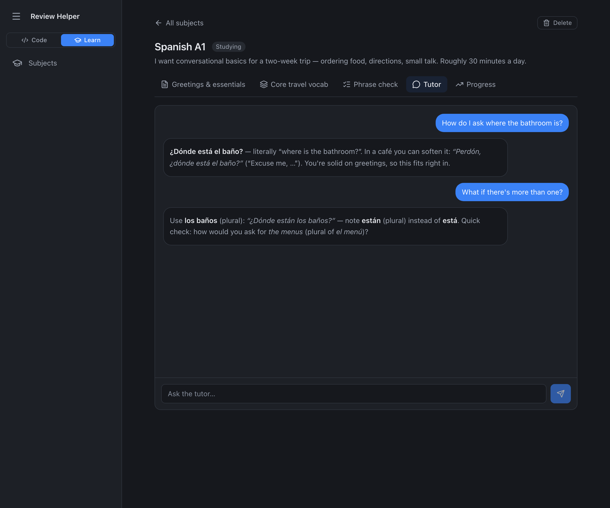
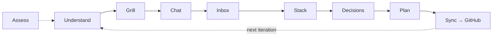
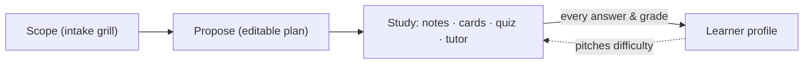
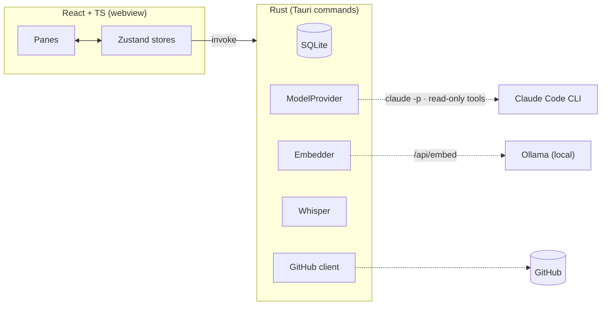

<div align="center">


<br/>

**Plan it properly, get grilled until it's specified, ship a phased plan to GitHub — then flip one switch and use the same engine to study anything.**

<br/>


<br/>


</div>

---

Review Helper is a native macOS app for people who build with AI coding agents. Most AI-assisted projects don't fail at the code — they fail at the **spec**. This app points a model at your repo (or just an idea), scores it on the dimensions that decide whether an agent build succeeds, interrogates the gaps until the project is actually specified, and produces one phased plan synced to GitHub issues. You hand that plan to your agent and build phase by phase.

It is one self-contained `.app`: Rust backend, embedded SQLite, React UI. No servers, no cloud database — and the voice capture, embeddings, and learner profile never leave your Mac.

> [!NOTE]
> **The model can never touch your code.** Planning and analysis calls get read/search tools only — no write, no edit, no shell — enforced in one place all model use flows through. The app performs every file write, commit, and issue change itself, and only after you approve an exact preview. A deterministic scanner blocks secrets from every commit.

## Screenshots

<table>
  <tr>
    <td width="50%"><br/><sub><b>Overview</b> — six vibecoding dimensions plus production readiness, scored 0–100 from real repo signals.</sub></td>
    <td width="50%"><br/><sub><b>Grill</b> — repo-specific questions with draft answers; the coverage meter says when you've specified enough.</sub></td>
  </tr>
  <tr>
    <td><br/><sub><b>Plan</b> — phases, tasks with "done when" checks, decisions, and the gated GitHub sync.</sub></td>
    <td><br/><sub><b>Chat</b> — anything the model infers becomes a pending suggestion; nothing reaches the record silently.</sub></td>
  </tr>
  <tr>
    <td><br/><sub><b>Understand</b> — a self-extending concept-card library; every card opens an inline chat.</sub></td>
    <td><br/><sub><b>Learning mode</b> — the tutor, answering at your level from your own materials.</sub></td>
  </tr>
</table>

## Code mode — the planning loop

The sidebar follows the loop: understand → grill → chat → inbox → stack → decisions → plan → sync. The plan is the synthesis, not the starting point.



- **Assess** scores six vibecoding dimensions plus production readiness, grounded in repo metrics rather than vibes.
- **Grill** asks repo-specific questions, each with a recommended answer and a model-chosen input type; a coverage meter tracks how specified you are.
- **Chat** has persistent cross-chat memory; inferred decisions, features, and stack choices arrive as suggestions you approve singly or in bulk.
- **Plan → GitHub** pushes one issue per phase (stable markers, so re-pushes update instead of duplicating). Issue closes and file deletions happen only behind an exact, confirmed preview that is cryptographically bound to the project it was computed for.
- **Voice capture**: dictate inbox ideas to an on-device Whisper model (`large-v3-turbo`, Metal) — live partial transcripts while you speak, ~3× realtime on an M4, nothing uploaded.

## Learning mode

Flip the Code ↔ Learn switch and the whole app becomes a study workspace. Upload material (text, Markdown, PDF) or describe a goal; it grills you on scope *first*, proposes a study plan you edit, then generates notes, flashcards, and quizzes — and a tutor that answers from your actual documents.



Three things make it more than a flashcard app:

1. **Full-document coverage.** Big uploads are split into structure-aware sections; the plan is proposed per section and every module's material is grounded on the exact part of the document it came from. Nothing is silently truncated.
2. **Grounded answers.** Documents are indexed twice — SQLite FTS5 keywords and local `nomic-embed-text` vectors (Ollama) — fused with reciprocal-rank fusion. The tutor cites its sources as `[n]`, says plainly when your materials don't cover something, and touches the web only behind a per-subject opt-in with a visible "includes web results" badge. The common path adds zero extra model calls.
3. **Evidence-based adaptation.** No "learning styles" (the research is unambiguous: matching instruction to VARK styles has a negligible effect). Instead: retrieval practice, FSRS spaced repetition with a real due queue, Bayesian Knowledge Tracing per skill — and an [adaptive profile](#the-adaptive-profile) built from what you measurably do.

## The adaptive profile

The app maintains two Markdown files you can open, edit, and diff — `learner-profile.md` and `review-preferences.md`. Measured facts (quiz accuracy, flashcard lapses, suggestion verdicts, grill answer depth) are aggregated with plain SQL at zero model cost; once a session, a single gated haiku-tier call rewrites a capped, evidence-cited *Observations* section. Excerpts ride quietly into the tutor, the generators, and the review prompts. Your notes section is never auto-edited — proven by a test that rewrites the file 100 times — and one Settings toggle turns the whole system off.

## Architecture

The frontend is pixels and intent; everything privileged — filesystem, GitHub, spawning `claude` — happens in Rust behind named Tauri commands.



| Layer | Choice |
|---|---|
| Shell | Tauri 2 — one native `.app`, ad-hoc signed (notarization documented in [`RELEASE.md`](./RELEASE.md)) |
| Backend | Rust — owns SQLite, the GitHub client, the model layer, every write |
| Frontend | React 19 + TypeScript + Tailwind v4, Zustand state |
| Database | Embedded SQLite (`rusqlite`, bundled — FTS5 included) |
| Model | Claude Code CLI (`claude -p`, stream-json) behind one `ModelProvider` trait — cancellable, hard-timeout, process-group killed |
| Retrieval | FTS5 + local `nomic-embed-text` via Ollama, RRF fusion, brute-force cosine (right-sized for hundreds of chunks per subject) |
| Voice | `whisper-rs` (whisper.cpp, Metal) + `cpal` capture; model auto-downloaded and sha256-verified on first use |
| Learning engine | `rs-fsrs` spaced repetition + in-house Bayesian Knowledge Tracing |

## Security model

- **Read-only model, by construction** — one allow-list (`Read, Grep, Glob`, plus web only where explicitly intended) and a `--disallowedTools` denial as defense in depth. The retrieval-grounded tutor path provably never receives web tools (capture-tested).
- **Secrets** — the GitHub token lives in the macOS Keychain only; a pre-commit hook and CI both run a deterministic secret scanner.
- **Nothing silent** — model-inferred changes are pending suggestions; GitHub deletions/closes execute only an exact confirmed preview, which the backend rejects if it was computed for a different project.
- **Untrusted input is fenced** — repo text, chat history, and document excerpts enter prompts as delimited data, never as instructions.

The full trust model, including the deliberate decision to treat *imported* repos as trusted input, is in [`SECURITY.md`](./SECURITY.md).

## How it was built

The interesting part: this app was built the way it tells you to build — phased plan, one phase at a time, "done when" checks, with the model read-only the whole way. The history is unusually legible:

- **Phases 1–14** built it; a five-round multi-agent council review hardened it (~34 fixes: CSP, symlink-escape closure, prompt-injection fencing, a WCAG-AA pass).
- A **55-agent audit** then found 52 verified bugs — every finding adversarially checked against the code, zero refuted ([`.planning/AUDIT-2026-06-09.md`](./.planning/AUDIT-2026-06-09.md)).
- **Phases 15–21** fixed all 52 and added the voice, profile, and RAG systems. Every fix carries a regression test that fails on the old code, and a CI contract suite now statically cross-checks every frontend `invoke()` against the registered Rust commands — the exact bug class that let "Delete subject" ship dead for weeks.

Current suites: **159 Rust + 103 frontend tests**, green, on every push.

<details>
<summary><b>Full phase history (1–21 + the A–H overhaul)</b></summary>

| # | Phase |
|---|-------|
| 1–14 | Scaffold → model provider → GitHub → analysis → assessment → Understand → Grill → Chat → Decisions/Stack → Inbox → Sync → Visualization → Hardening → Learning entry |
| A–H | Visual fixes · Easy↔Technical toggle · Plan readability · Persistent chat memory · Generative grill inputs · Understand redesign · **Learning mode** (FSRS/BKT engine) · Design export |
| 15 | Destructive-action safety + the IPC contract suite |
| 16 | Unfreeze & control — cancellable model layer, timeouts, Stop/Cancel everywhere |
| 17 | Settings truth — provider honesty, FSRS due queue, transactional saves & migrations |
| 18 | Polish sweep — races, a11y, project rename/delete, dead code removal |
| 19 | Local Whisper voice capture + full-document chunked ingest |
| 20 | Adaptive self-learning profile (researched against Honcho/mem0/Letta — servers rejected, patterns borrowed) |
| 21 | Study-material RAG (NirDiamant's RAG_Techniques subset, right-sized + eval floor in CI) |

Per-phase goals, tasks, and recorded deviations live in [`.planning/phases/`](./.planning/phases/). A new-engineer [`HANDOFF.md`](./HANDOFF.md) covers architecture and schema in depth.

</details>

## Install & run

**Prerequisites:** macOS 11+, [Claude Code](https://claude.com/claude-code) installed and signed in. Optional: [Ollama](https://ollama.com) with `nomic-embed-text` for semantic study search (keyword search works without it).

```bash
npm install
npm run tauri build -- --bundles app   # → src-tauri/target/release/bundle/macos/Review Helper.app
```

First build is slow (Tauri + SQLite + whisper.cpp compile from source). The bundle is ad-hoc signed — right-click → Open on first launch. If Claude ever shows as unavailable in the app, the banner's **Connect in Terminal** button opens a terminal with `claude` already running to walk you through login.

```bash
npm run tauri dev        # develop with HMR
npm test                 # frontend tests
cargo test --manifest-path src-tauri/Cargo.toml --lib   # backend tests
npm run export:design    # self-contained HTML snapshot of every screen, all 8 themes
```

---

<div align="center">
<sub><b>Review Helper</b> · plan it right, then build it · learn it right, then remember it</sub>
</div>
