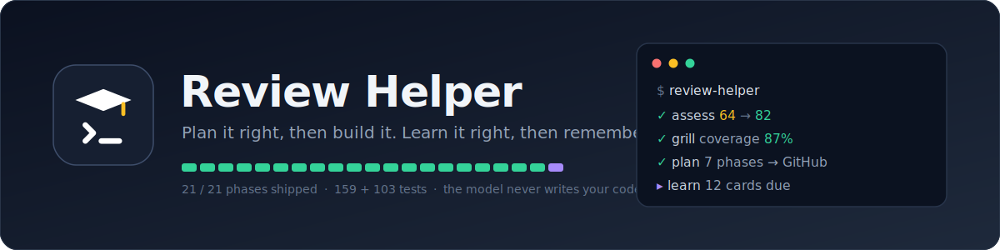
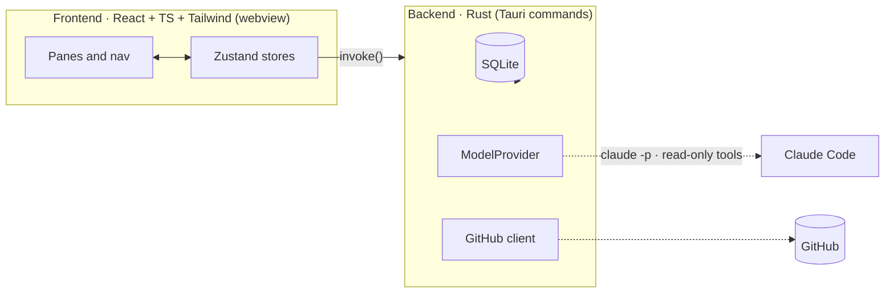

<div align="center">



<br/>

**A macOS desktop app that helps you _vibecode the right way_ — analyze a project, score it, and get grilled until it's specified well enough to actually build.**

<br/>


<br/>


</div>

---

## What is this?

Review Helper turns _"I have a vague app idea"_ into a build you can trust. It points a model at your project (or just your plan), scores it across the dimensions that make AI-assisted builds succeed or fail, interrogates the gaps, teaches you the concepts as you go, and produces a single consistent **phased plan** synced to GitHub issues. You hand that plan to your coding agent and build it phase by phase — with the guardrails already in place.

It's one self-contained native app: a Rust backend with embedded SQLite and a React UI. No servers to run, no separate database to launch.

## Why

Most AI-assisted projects don't fail at the code — they fail at the **spec**: under-specified ideas, the model loose in your filesystem, secrets committed by accident, finished work silently rebuilt. Review Helper closes those failure modes by construction.

> [!NOTE]
> **The model is read-only against your source.** Planning and analysis run with read/search tools only — never write, edit, or shell. The app performs every file write, commit, and issue change itself, and only after you approve it. Model-inferred changes arrive as **pending suggestions**, never silent writes; secrets are blocked from commits by a deterministic scanner; and the database schema ships pre-tested.

## Features

- 🔍 **Analyze & score** — six vibecoding dimensions, a separate production-readiness scorecard, and a hygiene check, all 0–100 and grounded in real repo metrics rather than vibes.
- 🔥 **Grill-me** — repo-specific questions (each with a draft answer) that pin down what you're actually building; a depth slider and a **Detail Coverage** meter tell you when you've specified enough.
- 📚 **Understand hub** — a self-extending learning hub spanning architecture, frontend, backend, pipes, deployment, business, design and UX. Understanding is the main activity here, not a glossary in the corner.
- 🧭 **Plan → GitHub** — one consistent phased plan, synced one-way to issues (one per phase, matched by a stable marker so re-pushes update instead of duplicating), behind a gated, fully-previewed push to `main`.
- 💬 **Two-way chat & suggestions** — talk your project through; anything the model infers becomes a pending suggestion you approve (single or bulk).
- 🎨 **Four themes** — `light`, `dark`, `midnight`, and `sand`, every surface driven by design tokens.

## Architecture

The frontend is "pixels + intent"; all privileged work — the filesystem, the GitHub network, spawning `claude` — happens in Rust behind named Tauri commands.



## Tech stack

| Layer | Choice |
|---|---|
| Shell | **Tauri 2** — one signed, notarized native `.app` |
| Backend | **Rust** — owns SQLite, the GitHub client, the model layer, and every write/commit |
| Frontend | **React 19 + TypeScript + Tailwind v4**, lightweight **Zustand** state |
| Database | **embedded SQLite** via `rusqlite` (bundled — no system dependency) |
| Model | **Claude Code** via `claude -p` (stream-json) behind a `ModelProvider` interface |

## Status & roadmap

Built one phase at a time, each phase verified before the next begins. **Phase 1 — the project scaffold & app shell — is complete:** a themed, navigable shell (four themes), SQLite wired with idempotent migrations, and the hamburger nav with clean empty states.

<details>
<summary><b>Full 14-phase roadmap</b></summary>

| # | Phase | Status |
|---|-------|--------|
| 1 | Project scaffold & app shell | ✅ Done |
| 2 | Model provider & Claude availability | ⬜ Next |
| 3 | Projects & GitHub connect | ⬜ |
| 4 | Repo analysis & cold start | ⬜ |
| 5 | Assessment engine & State pane | ⬜ |
| 6 | The Understand hub | ⬜ |
| 7 | Grill-me cards & detail coverage | ⬜ |
| 8 | Two-way chat & structured proposals | ⬜ |
| 9 | Decisions, suggestions & stack panes | ⬜ |
| 10 | Feature inbox & plan regeneration | ⬜ |
| 11 | GitHub sync out | ⬜ |
| 12 | Visualization, first-run & polish | ⬜ |
| 13 | Production hardening | ⬜ |
| 14 | Coming-soon learning mode (stub) | ⬜ |

</details>

## Development

Prerequisites: **Rust** (stable) and **Node 20+** on macOS, with the Xcode Command Line Tools (`xcode-select --install`).

```bash
npm install                                        # install frontend deps
npm run tauri dev                                  # run the app (native window)

npm test                                           # frontend tests (Vitest + Testing Library)
cargo test --manifest-path src-tauri/Cargo.toml    # Rust tests (DB layer, migrations, CRUD)
npm run build                                       # production frontend build
```

The first `cargo` build is slow — it compiles Tauri and SQLite from source; subsequent builds are incremental.

---

<div align="center">
<sub><b>Review Helper</b> · vibecode the right way</sub>
</div>
