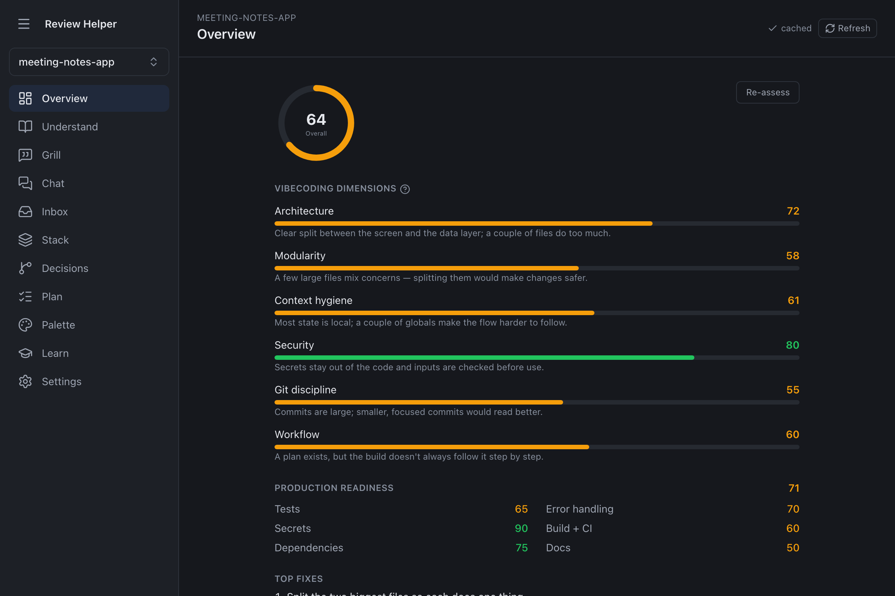
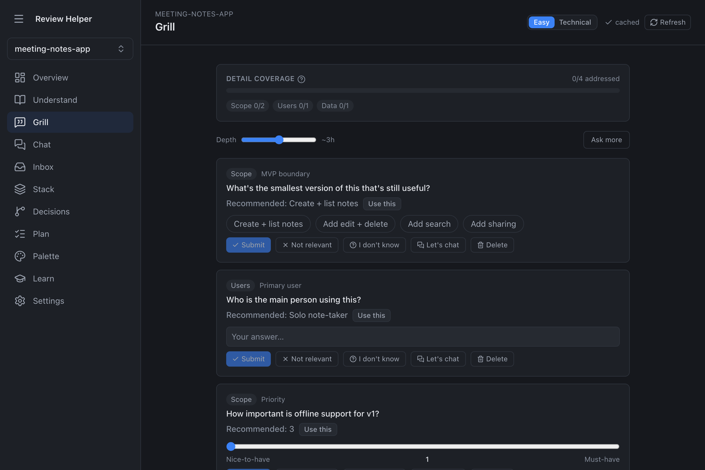
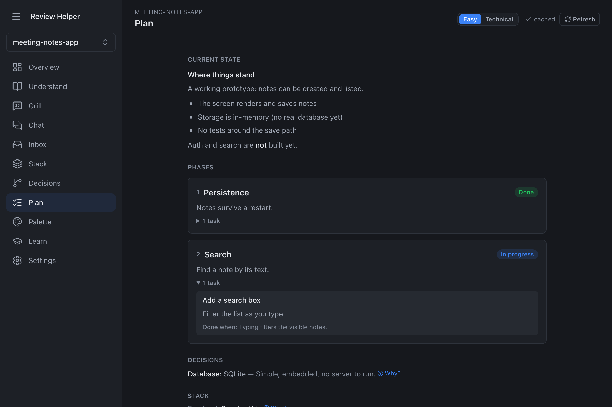
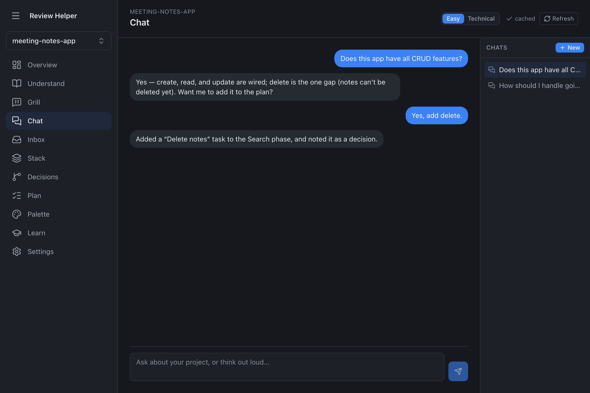
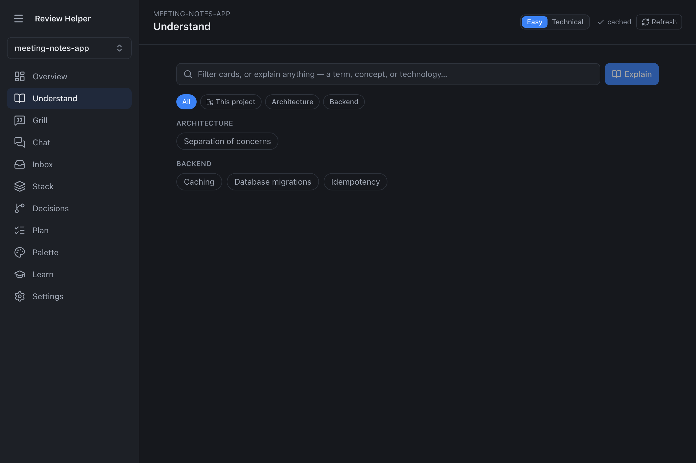
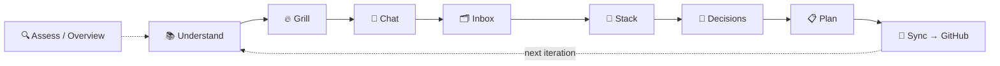
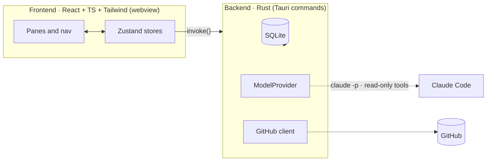

<div align="center">


<br/>

**A macOS desktop app that helps you _vibecode the right way_ — analyze a project, score it, get grilled until it's specified well enough to actually build, then ship a phased plan to GitHub.**

<br/>


<br/>


</div>

---

## What is this?

Review Helper turns _"I have a vague app idea"_ into a build you can trust. It points a model at your project (or just your description), scores it across the dimensions that make AI-assisted builds succeed or fail, interrogates the gaps, teaches you the concepts as you go, and produces a single consistent **phased plan** synced to GitHub issues. You hand that plan to your coding agent and build it phase by phase — with the guardrails already in place.

It's one self-contained native app: a Rust backend with embedded SQLite and a React UI. No servers to run, no separate database to launch.

## Why

Most AI-assisted projects don't fail at the code — they fail at the **spec**: under-specified ideas, the model loose in your filesystem, secrets committed by accident, finished work silently rebuilt. Review Helper closes those failure modes by construction.

> [!NOTE]
> **The model is read-only against your source.** Planning and analysis run with read/search tools only — never write, edit, or shell. The app performs every file write, commit, and issue change itself, and only after you approve it. Model-inferred changes arrive as **pending suggestions**, never silent writes; secrets are blocked from commits by a deterministic scanner; and the database schema ships pre-tested.

## Features

- 🔍 **Analyze & score** — six vibecoding dimensions, a separate production-readiness scorecard, and a hygiene check, all 0–100 and grounded in real repo metrics rather than vibes.
- 🔥 **Grill-me** — repo-specific questions (each with a draft answer) that pin down what you're actually building; a depth slider and a **Detail Coverage** meter tell you when you've specified enough.
- 📚 **Understand hub** — a self-extending learning hub spanning architecture, frontend, backend, pipes, deployment, business, design and UX. Understanding is the main activity here, not a glossary in the corner.
- 💬 **Two-way chat & suggestions** — talk your project through; anything the model infers becomes a pending suggestion you approve (single or bulk), so nothing reaches the record silently.
- 🗂️ **Decisions, stack & feature inbox** — an ADR-style decision log (with supersede history), a five-pane stack picker, and a quick-capture inbox that nudges you to fold ideas into the plan.
- 🧭 **Plan → GitHub** — one consistent phased plan, synced one-way to issues (one per phase, matched by a stable marker so re-pushes update instead of duplicating), behind a gated, fully-previewed push to `main`.
- 📊 **Visualization & onboarding** — radar/gauge/donut charts for the scorecard, a first-run tour, and inline "why" explainers.
- 🎨 **Four themes** — `light`, `dark`, `midnight`, and `sand`, every surface driven by design tokens, WCAG-AA contrast, and full keyboard focus rings.

## Screenshots

> 📸 This section is wired up — drop the six PNGs named below into [`docs/screenshots/`](./docs/screenshots/) (see the [capture guide](./docs/screenshots/README.md)) and they render here automatically. Capture on a project that has a generated plan + assessment so the data-rich views show real content.

<table>
  <tr>
    <td width="50%"><br/><sub><b>Overview</b> — six-dimension scorecard, production readiness, and hygiene as radar + gauges.</sub></td>
    <td width="50%"><br/><sub><b>Grill</b> — repo-specific questions with draft answers, the depth slider, and the coverage meter.</sub></td>
  </tr>
  <tr>
    <td><br/><sub><b>Plan</b> — the phased plan with tasks, decisions, and stack, plus the gated GitHub sync panel.</sub></td>
    <td><br/><sub><b>Chat</b> — two-way conversation with pending suggestions you approve or dismiss inline.</sub></td>
  </tr>
  <tr>
    <td><br/><sub><b>Understand</b> — the self-extending concept-card hub across every build domain.</sub></td>
    <td><br/><sub><b>Themes</b> — the same screen in <code>light</code> / <code>dark</code> / <code>midnight</code> / <code>sand</code>.</sub></td>
  </tr>
</table>

## How it works — the planning loop

The sidebar follows the loop, in order: **understand → grill → chat → inbox → stack → decisions → plan → sync**. You gather understanding and scope first; the plan is the synthesis, not the starting point.



## Architecture

The frontend is "pixels + intent"; all privileged work — the filesystem, the GitHub network, spawning `claude` — happens in Rust behind named Tauri commands. A single mutex-guarded SQLite connection serializes all state; background model runs stream progress over events and are panic-guarded.



## Tech stack

| Layer | Choice |
|---|---|
| Shell | **Tauri 2** — one signed, notarized native `.app` |
| Backend | **Rust** — owns SQLite, the GitHub client, the model layer, and every write/commit |
| Frontend | **React 19 + TypeScript + Tailwind v4**, lightweight **Zustand** state |
| Database | **embedded SQLite** via `rusqlite` (bundled — no system dependency) |
| Model | **Claude Code** via `claude -p` (stream-json) behind a `ModelProvider` interface |

## Security & trust boundaries

- **Read-only model** — planning/analysis pass only read/search tools (`Read, Grep, Glob, WebSearch, WebFetch`), plus an explicit `--disallowedTools` list as defense in depth. No code path lets the model write or commit your repo.
- **Secrets stay out of the tree** — the GitHub token lives only in the macOS Keychain; a `PreToolUse` git hook runs a deterministic secret scanner and blocks any commit that stages a credential (CI runs the same scan).
- **Nothing silent** — inferred changes are pending suggestions you approve; GitHub deletions/closes happen only after a confirmed, exact preview.
- **Hardened inputs** — prompt context is fenced as untrusted data (backtick-delimited + neutralized, length-bounded); clone scanning refuses symlinks that escape the clone; GitHub URLs are HTTPS/SSH-only; the HTTP client has connect/overall timeouts.

See [`SECURITY.md`](./SECURITY.md) for the full trust model and dependency audit.

## Quality — how it was built

Built one phase at a time, each phase verified against its "Done when" checks before the next began, and each followed by a **5-angle review** (two subagents per angle) with a critical/high fix pass.

After the 14th phase, a **5-round multi-agent council finale** hardened the codebase: each round dispatched **50 analyst subagents** → three specialist councils (correctness/security/data-integrity · product/UX/accessibility · architecture/maintainability/testing) → a **grand council** that picked bounded, test-backed, cross-council improvements and discarded the false positives. ~34 improvements shipped across the five rounds (CSP, symlink-escape closure, HTTP timeouts, crash-safe WAL + busy-timeout, prompt-injection hardening, gate poison-recovery, a full WCAG-AA accessibility pass, and more).

- ✅ **106 backend tests** (`cargo test --lib`) + **75 frontend tests** (Vitest) — all green.
- ✅ CI on pinned `macos-15`: secrets gate → frontend build/test → `cargo test` → `cargo build`.

## Roadmap

All 14 build phases are complete; the project is feature-complete for v0.1 and in continuous-improvement mode.

<details>
<summary><b>Full 14-phase roadmap</b></summary>

| # | Phase | Status |
|---|-------|--------|
| 1 | Project scaffold & app shell | ✅ Done |
| 2 | Model provider & Claude availability | ✅ Done |
| 3 | Projects & GitHub connect | ✅ Done |
| 4 | Repo analysis & cold start | ✅ Done |
| 5 | Assessment engine & State pane | ✅ Done |
| 6 | The Understand hub | ✅ Done |
| 7 | Grill-me cards & detail coverage | ✅ Done |
| 8 | Two-way chat & structured proposals | ✅ Done |
| 9 | Decisions, suggestions & stack panes | ✅ Done |
| 10 | Feature inbox & plan regeneration | ✅ Done |
| 11 | GitHub sync out | ✅ Done |
| 12 | Visualization, first-run & polish | ✅ Done |
| 13 | Production hardening | ✅ Done |
| 14 | Coming-soon learning mode (stub) | ✅ Done (stub) |

</details>

A new-engineer [`HANDOFF.md`](./HANDOFF.md) covers the architecture, schema, dev process, and the full change history in depth.

## Install & run

**Prerequisites:** macOS, [Claude Code](https://claude.com/claude-code) installed and signed in (the app drives the `claude` CLI), and for building from source: **Rust** (stable) + **Node 20+** with Xcode Command Line Tools (`xcode-select --install`).

### Build the app

```bash
npm install
npm run tauri build -- --bundles app   # produces "Review Helper.app" under src-tauri/target/release/bundle/macos/
```

The first build is slow (it compiles Tauri + SQLite from source); later builds are incremental. The bundle is ad-hoc signed — on first launch, right-click → **Open** to clear Gatekeeper. (Full Developer-ID notarization is documented in [`RELEASE.md`](./RELEASE.md) and needs an Apple signing identity.)

### Develop

```bash
npm run tauri dev                                  # run the app (native window) with HMR
npm test                                           # frontend tests (Vitest + Testing Library)
cargo test --manifest-path src-tauri/Cargo.toml --lib   # Rust tests (model, plan, sync, schema, security)
npm run build                                       # production frontend build
```

---

<div align="center">
<sub><b>Review Helper</b> · vibecode the right way</sub>
</div>
